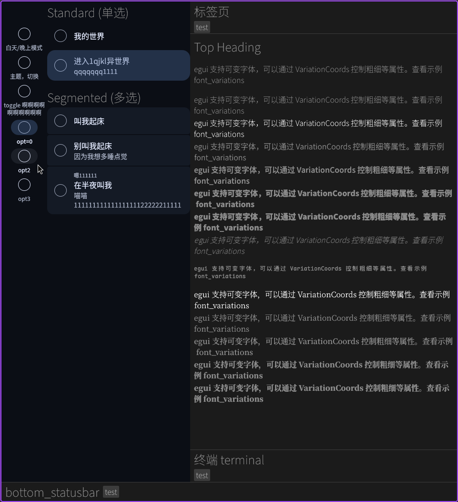

# hnfm-egui-test

egui 自定义 material 3 组件测试代码，未来会移植到[另一项目](https://github.com/sb-child/HoshinekoFM)

运行 [`download_fonts.py`](./download_fonts.py) 下载字体 (没写 `build.rs`)

## todo list

- 字体([src/fonts/](./src/fonts/)): 但是没有用 Roboto
- 颜色([src/material/color.rs](./src/material/color.rs)): 能用
- 图标 [Material Symbols](https://m3.material.io/styles/icons/overview): todo
- [Navigation Rail](https://m3.material.io/components/navigation-rail/specs): 能用
- [Lists](https://m3.material.io/components/lists/specs): 能用

## Sources

- https://m3.material.io/components
- 还有 deepseek 陪我写
- 部分灵感来自于 https://github.com/sb-child/egui-material3 (forked from [nikescar/egui-material3](https://github.com/nikescar/egui-material3))

## License

MIT
